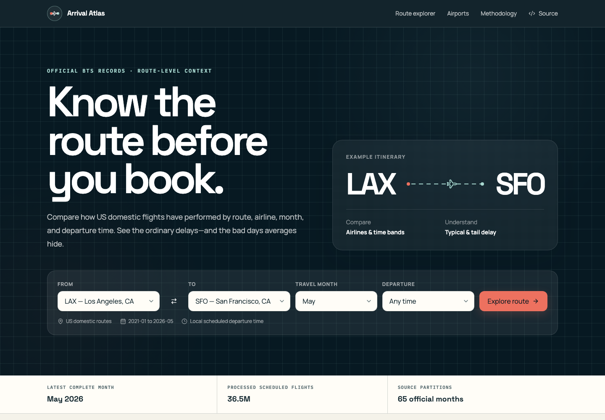
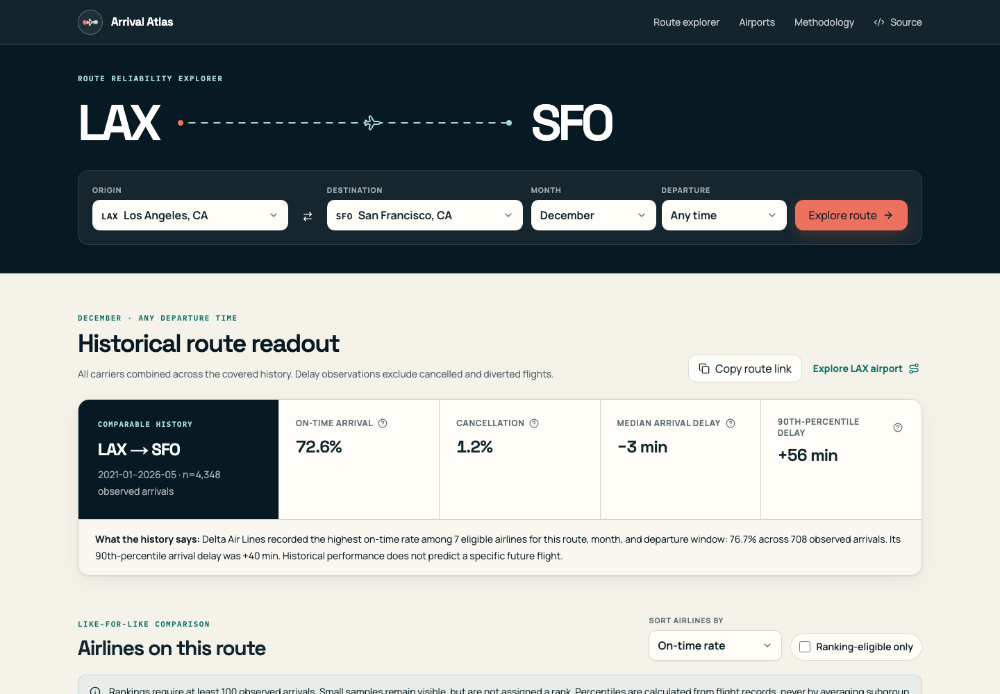
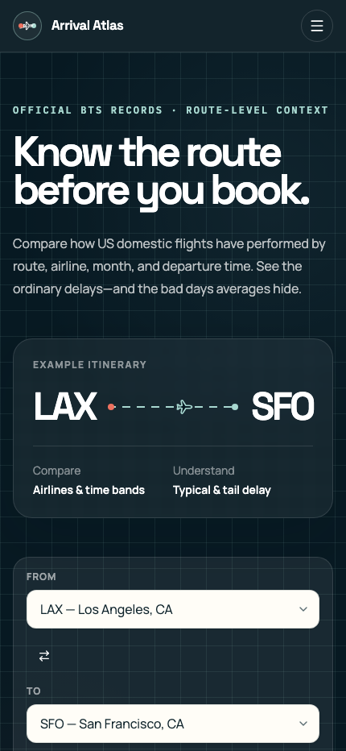
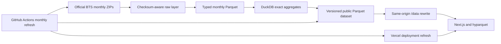

# Arrival Atlas

[](https://github.com/heybadrinath/arrival-atlas/actions/workflows/ci.yml)
[](https://github.com/heybadrinath/arrival-atlas/releases/latest)
[](https://github.com/heybadrinath/arrival-atlas/deployments)
[](LICENSE)

[Explore the live product](https://arrival-atlas.vercel.app) · [View releases](https://github.com/heybadrinath/arrival-atlas/releases) · [Browse the public dataset](https://github.com/heybadrinath/arrival-atlas-data) · [Read the methodology](https://arrival-atlas.vercel.app/methodology) · [Contribute](CONTRIBUTING.md)

Arrival Atlas is a public, historical flight-reliability explorer for US domestic routes. It
helps a traveler compare the airlines that actually served a route in the same calendar month
and departure-time window—without turning historical data into a prediction or an opaque score.



## Why this exists

Airline-wide averages are weak evidence for a booking decision. Reliability changes by route,
season, operating carrier, airport, and scheduled departure time. Arrival Atlas keeps that
context visible, reports the observation count behind each number, and leaves small samples
unranked.

The product answers questions such as:

> For LAX to SFO in December, which eligible airlines historically recorded fewer late arrivals,
> and how did morning, afternoon, and evening departures differ?

It does not forecast a specific flight. Current weather, schedules, staffing, and operations can
make a future trip differ materially from the historical record.

## What you can explore

- Search airports by code or city with keyboard-friendly selectors, swap route endpoints, and
  filter by calendar month and scheduled departure time
- Reopen recent routes and copy a stable link to any route comparison
- Compare scheduled flights, observation counts, on-time and cancellation rates, median, P75,
  P90, and severe-delay rates across airlines that actually served the route
- Review a deterministic plain-language summary and the same month versus the prior year
- Inspect monthly reliability, delay distribution, time-band, delay-cause, volume, and historical
  carrier-coverage views
- Explore airport trends, active routes, cancellations, severe delays, and route drill-downs
- Audit definitions, denominators, sample rules, source freshness, quality checks, and limitations
- Use the responsive interface with a keyboard, screen reader, or reduced-motion preference

<p align="center">
  
  
</p>

## Data at a glance

The current verified snapshot uses 65 official monthly BTS partitions.

| Property                      |                   Verified value |
| ----------------------------- | -------------------------------: |
| Coverage                      |            January 2021–May 2026 |
| Latest complete source month  |                         May 2026 |
| Cleaned scheduled-flight rows |                       36,533,897 |
| Arrival-delay observations    |                       35,805,791 |
| Aggregate rows                |                        4,556,244 |
| Aggregate Parquet files       |                            2,667 |
| Aggregate payload             |    131,053,164 bytes (125.0 MiB) |
| Airports / directional routes |                      382 / 8,434 |
| Ranking minimum               | 100 observed arrivals per cohort |

Source rows and cleaned rows reconcile exactly in this snapshot; no duplicate stable flight keys
were found. The pipeline flagged 24 impossible scheduled-duration values for audit rather than
silently rewriting source delay fields.

## Architecture

The expensive work happens offline. The public application has no database and never sends raw
flight rows to a browser.



- **Frontend:** Next.js App Router, React, TypeScript, Tailwind CSS, ECharts, and `hyparquet`
- **Pipeline:** Python 3.12, DuckDB, Zstandard-compressed Parquet, HTTP checksums, and Pytest
- **Data delivery:** one same-origin `/data` URL per origin and table, rewritten to the public
  dataset repository; only selected-origin partitions are fetched
- **Hosting:** Vercel Hobby plus public GitHub source and dataset repositories
- **Recurring launch cost:** $0 for personal, non-commercial use within provider limits

See [the detailed architecture](docs/ARCHITECTURE.md) and [deployment notes](docs/DEPLOYMENT.md).

## Releases and deployment

Source releases and production deployments are deliberately separate, visible histories:

| History                | What it records                                 | Where to inspect                                                                |
| ---------------------- | ----------------------------------------------- | ------------------------------------------------------------------------------- |
| GitHub Releases        | Versioned, documented source milestones         | [Latest release](https://github.com/heybadrinath/arrival-atlas/releases/latest) |
| GitHub Deployments     | Vercel deployment status for an exact commit    | [Deployment history](https://github.com/heybadrinath/arrival-atlas/deployments) |
| Production application | The current deployment behind the canonical URL | [arrival-atlas.vercel.app](https://arrival-atlas.vercel.app)                    |

Every push to `main` is deployed by the existing Vercel Git integration. A semantic version tag
such as `v0.1.0` runs [the release workflow](.github/workflows/release.yml), which validates the
tag against `package.json` and publishes its checked-in release notes. Creating a release does not
start a second deployment pipeline or require duplicate Vercel credentials.

See [the release runbook](docs/RELEASES.md), [changelog](CHANGELOG.md), and
[deployment and rollback guide](docs/DEPLOYMENT.md).

## Metric design

Arrival Atlas follows the BTS definition of on time: an observed arrival with `ArrDelay < 15`
minutes. Cancelled and diverted flights are excluded from delay percentiles and are never assigned
a zero-minute delay.

Rates are published as numerator and denominator counts so they can be audited or recalculated.
Median, P75, and P90 are exact continuous quantiles calculated from the selected flight cohort;
the `All` time-band percentile is not an average of subgroup percentiles.

See [all formulas and denominators](docs/METRICS.md).

## Data source and lineage

The source of record is the US Bureau of Transportation Statistics
[Reporting Carrier On-Time Performance table](https://www.transtats.bts.gov/TableInfo.asp?QO_fu146_anzr=b0-gvzr&gnoyr_VQ=FGJ).
Monthly files come from the official [TranStats download interface](https://www.transtats.bts.gov/DL_SelectFields.aspx?QO_fu146_anzr=b0-gvzr&gnoyr_VQ=FGJ).

For each source partition the local raw manifest records its URL, download time, ETag, source
modification date, byte count, and SHA-256 checksum. Raw ZIPs and cleaned flight rows stay outside
Git. The public dataset contains only application-ready aggregates, a manifest, checksums, and a
compact browser catalog plus a dataset card.

See [pipeline design and reconciliation rules](docs/DATA_PIPELINE.md) and the
[public dataset card](https://github.com/heybadrinath/arrival-atlas-data).

## Local web setup

Requirements: Node.js 24 and pnpm 10.28.1.

```bash
git clone https://github.com/heybadrinath/arrival-atlas.git
cd arrival-atlas
pnpm install --frozen-lockfile
cp .env.example .env.local
```

Set the public aggregate resolver in `.env.local`:

```text
NEXT_PUBLIC_DATA_BASE_URL=/data
NEXT_PUBLIC_SITE_URL=http://localhost:3000
```

Then run:

```bash
pnpm dev
```

Open `http://localhost:3000`. No credential is needed to read the public dataset.

## Rebuild the data

Requirements: Python 3.12, `uv`, and roughly 4 GB of free working storage for the current scope.

```bash
uv sync --frozen --dev
uv run arrival-data discover
uv run arrival-data refresh --start 2021-01
```

For the exact published cutoff:

```bash
uv run arrival-data refresh --start 2021-01 --through 2026-05
```

The refresh creates reproducible raw, cleaned, and application-ready layers under `data/`, copies
the current aggregate snapshot to ignored `public/data/` for local use, and stops on source schema
drift or failed quality checks. It downloads only missing or changed monthly partitions unless
`--force` is explicitly supplied.

## Tests and verification

```bash
pnpm check
pnpm build
pnpm test:e2e
pnpm links
pnpm verify:production
```

The suites cover metric denominators and exact quantiles; duplicate, cancellation, diversion,
missing-cause, historical-code, invalid-duration, and current-partial-month handling; manifest and
aggregate reconciliation; component behavior; route search; filter updates; tooltips; no-data,
small-sample, invalid-query, and network-error states; and desktop/mobile overflow.
`verify:production` targets `https://arrival-atlas.vercel.app` by default; set `LIVE_SITE_URL` to
verify another deployment.

## Contributing

Focused contributions are welcome, especially fixes or improvements related to accessibility,
documentation, data quality, metric correctness, tests, and the traveler-facing experience.

Start with the [contribution guide](CONTRIBUTING.md). For a material metric, schema, or
architecture change, [open an issue](https://github.com/heybadrinath/arrival-atlas/issues/new)
before investing in an implementation. Pull requests run the frontend, pipeline, build, and
browser suites in GitHub Actions.

## Automated monthly refresh

`.github/workflows/data-refresh.yml` runs on the fifth day of each month and can also be dispatched
manually. It:

1. discovers the latest complete official month;
2. restores cached raw and cleaned partitions;
3. downloads and transforms only missing or changed partitions;
4. rejects schema drift and quality failures;
5. rebuilds versioned origin aggregates;
6. publishes and re-downloads the dataset manifest for verification; and
7. commits the new freshness manifest, triggering the connected Vercel deployment.

Repository maintainers need one repository-scoped `DATA_REPO_DEPLOY_KEY` Actions secret. See the
exact [deployment and rollback procedure](docs/DEPLOYMENT.md).

## Known limitations

- Historical descriptive performance is not a forecast or guarantee.
- BTS reporting-carrier records can differ from the marketing airline shown during booking.
- Carrier and airport labels change; stable DOT and airport IDs are retained alongside historical
  codes, but display names are maintained reference data.
- Delay-cause minutes are available only for qualifying delays and do not explain every late
  arrival.
- Current-year coverage stops at the latest complete published month.
- International, non-scheduled, and otherwise unreported flights are outside the source scope.
- Airport metrics summarize flights departing the selected airport and their downstream arrival
  outcomes; they are not airport service-level measures.
- High-volume origins can take several seconds to load cold from GitHub's free raw-file CDN behind
  the same-origin `/data` route; the application keeps an explicit loading state and never falls
  back to unverified values.
- Versioned snapshot commits grow the dataset repository history. Monitor repository size and
  migrate the aggregates to object storage before approaching GitHub's recommended 1 GB ceiling.
- Vercel Hobby is limited to personal, non-commercial use. A commercial launch requires an
  eligible plan or a different host.

## Repository map

```text
pipeline/                 source download, transform, aggregate, validation
src/app/                  product routes, metadata, methodology
src/components/           reusable UI, charts, route and airport explorers
src/lib/                  typed manifest and Parquet loading
tests/                    Python, component, and browser tests
docs/                     architecture, metrics, pipeline, release, and deployment guides
.github/workflows/        continuous integration, releases, and monthly data refresh
CHANGELOG.md              versioned record of user-visible changes
```

## License and security

Application and pipeline source are released under the [MIT License](LICENSE). The independently
processed BTS data is marked US Public Domain with attribution and provenance retained. Please
follow the [security policy](SECURITY.md) when reporting a suspected vulnerability.
