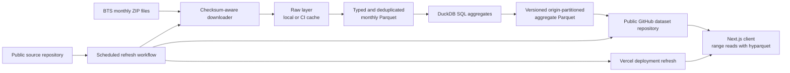

# Architecture

Arrival Atlas separates expensive official-data processing from the public request path. The
browser never scans raw flight rows and the web deployment does not operate a database.

## Web application

- Next.js App Router and TypeScript
- React client views for route and airport filters
- ECharts rendered as accessible SVG charts
- `hyparquet` range reads with Zstandard codec support
- Static metadata, methodology, social preview, sitemap, and robots policy
- No runtime function or database is required for the main analytics flow

The compact top-level dataset catalog maps each origin code to one Parquet file per table, while
the full lineage manifest retains every file checksum. Selecting an origin therefore loads only
the relevant route or airport partitions. In-memory promise caches prevent duplicate downloads
during one visit, and the largest historical-airline table starts only after the primary route
comparison is ready.

## Data pipeline

- Python 3.12+
- DuckDB for typed CSV reads, windowed deduplication, exact quantiles, and Parquet output
- Official monthly ZIPs retained outside Git with checksums and HTTP metadata
- Cleaned monthly Parquet retained outside Git and reusable across refreshes
- Seven application-ready tables partitioned by origin
- Pytest fixtures prove cancellation, diversion, duplicate, delay-cause, and percentile behavior

## Why offline aggregates

A complete five-year flight table is too large for a free public web request path. The displayed
questions have a stable set of dimensions, so exact cohort results can be calculated during a
monthly refresh. This keeps page requests small, repeatable, inexpensive, and auditable.

The tradeoff is that adding a new dimension requires a pipeline and schema update. That is a
better constraint than silently approximating percentiles or sending raw records to a browser.

## Stable identities

- Airline grouping uses `DOT_ID_Reporting_Airline` plus the historical reporting code.
- Airport grouping uses BTS airport ID and sequence ID; IATA-like codes remain display labels.
- Names are resolved at display time and never used as analytical keys.
- The cleaned layer retains historical codes so mergers and reused labels are not collapsed by
  display name.
